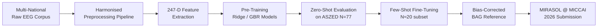
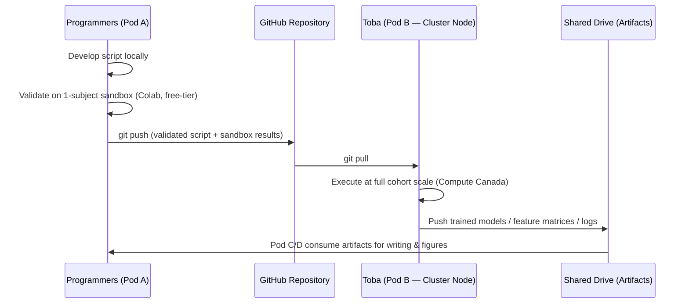

# EEG-Based Brain Age Modelling in African Populations

### Quantifying Cross-Population Generalisation Gap and First Brain Age Gap Reference for Healthy Nigerian Adults Using Low-Cost Portable EEG

[](https://miccai.org)
[](#9-license)
[](https://www.python.org/)
[](#1-project-overview--roadmap)

---

## Table of Contents

1. [Project Overview & Roadmap](#1-project-overview--roadmap)
2. [Multi-National Dataset Registry](#2-multi-national-dataset-registry)
3. [Reproducible Pipeline Architecture](#3-reproducible-pipeline-architecture)
4. [Computation Relay Model & Division of Labor](#4-computation-relay-model--division-of-labor)
5. [Interactive Command-Line Run Guide](#5-interactive-command-line-run-guide-hpc-architecture)
6. [Repository Structure](#6-repository-structure)
7. [Results Artifacts](#7-results-artifacts)
8. [Citation & Ethical Compliance](#8-citation--ethical-compliance)
9. [License](#9-license)

---

## 1. Project Overview & Roadmap

### 1.1 Synopsis

Brain age modelling estimates an individual's biological brain age from neurophysiological signals, with the deviation from chronological age — the **Brain Age Gap (BAG)** — serving as a quantitative biomarker of accelerated or decelerated neural ageing. Despite over a decade of methodological advancement in this field, **no published study has trained or validated an EEG-based brain age model on an indigenous African population as its primary target cohort.**

This repository contains the complete, reproducible implementation for the first such study. We construct an internationally pre-trained EEG brain age regression model using a multinational, resource-constrained-setting (RCS) inclusive training corpus, and evaluate **zero-shot** and **few-shot fine-tuned** generalisation performance on the **ASZED Nigerian healthy control cohort (N = 77)** — the first open-access African EEG dataset with exact, individually reported chronological ages.

> **Core Research Question:** Does a brain age regression model trained on a multinational, predominantly non-African EEG corpus generalise to a Nigerian population, what is the magnitude of the resulting cross-population generalisation gap (ΔMAE), and what is the normative Brain Age Gap distribution in healthy Nigerian adults?

### 1.2 Project Roadmap



| Phase | Milestone | Status |
|---|---|---|
| 1 | Dataset acquisition & access provisioning (TUAB, Dortmund, SRM, CHBMP, ASZED) | `In Progress` |
| 2 | Harmonised preprocessing pipeline validated across all 5 sources | `In Progress` |
| 3 | 247-dimensional feature extraction at full cohort scale | `Pending` |
| 4 | Baseline model training (Ridge, Gradient Boosting) with nested CV | `Pending` |
| 5 | Zero-shot evaluation on ASZED Nigerian cohort | `Pending` |
| 6 | Few-shot fine-tuning and bias-corrected BAG computation | `Pending` |
| 7 | Manuscript preparation and MIRASOL submission | `Pending` |

### 1.3 Alignment with MIRASOL 2026 Focus Areas

| Focus Area | Contribution of This Repository |
|---|---|
| **Focus Area 2 — Biosignals for Resource-Constrained Settings (RCS)** | The entire pipeline is engineered around low-cost, portable EEG acquisition systems (≤19-channel clinical-grade and consumer-grade headsets) as a scalable, affordable alternative to MRI-based brain ageing biomarkers in settings with near-zero scanner density. |
| **Focus Area 4 — AI Bias Mitigation & Equity** | We provide the first quantitative measurement of algorithmic generalisation bias when a non-African-trained brain age model is applied to an African cohort, operationalising "fairness" as a measurable ΔMAE and BAG distributional shift rather than a qualitative claim. |

---

## 2. Multi-National Dataset Registry

All datasets below are harmonised into a unified BIDS-adjacent processing schema. Five sources constitute the **international pre-training / baseline corpus**; one source constitutes the **target validation cohort**.

### 2.1 Pre-Training & Baseline Corpus

| Dataset | N (Usable) | Country of Origin | Cohort Type | Native Fs (Hz) | Open-Access Source |
|---|---|---|---|---|---|
| **TUAB** — Temple University Abnormal EEG Corpus | 2,993 recordings / 2,329 patients | United States | HIC | 250–512 (variable) | [isip.piconepress.com/projects/tuh_eeg](https://isip.piconepress.com/projects/tuh_eeg/html/downloads.shtml) *(credentialed access)* |
| **Dortmund Vital Study** | 608 | Germany | HIC | 500 | OpenNeuro `ds005385` |
| **SRM** — Stimulus-Selective Response Modulation | 111 | Norway | HIC | 1024 | OpenNeuro `ds003775` |
| **CHBMP** — Cuban Human Brain Mapping Project | 282 | Cuba | LMIC | 200 | [chbmp-open.loris.ca](https://chbmp-open.loris.ca) |
| **NMT** — Scalp EEG Dataset *(supplementary LMIC corpus)* | 2,002 (normal-labelled subset) | Pakistan | LMIC | 200 | [dll.seecs.nust.edu.pk/downloads](https://dll.seecs.nust.edu.pk/downloads/) |

### 2.2 Target Validation Cohort (African, Zero-Shot / Few-Shot)

| Dataset | N (Healthy Controls) | Country of Origin | Cohort Type | Native Fs (Hz) | Open-Access Source |
|---|---|---|---|---|---|
| **ASZED** — African Schizophrenia EEG Dataset | 77 | Nigeria | LMIC | 128 | Zenodo `10.5281/zenodo.14178398` (CC BY 4.0) |

> **Note on Combined Pre-Training Corpus Size:** N ≈ 6,000 recordings across 6 countries (5 HIC/LMIC sources) prior to artefact-based exclusion. Final usable N is reported post-FASTER rejection in `results/preprocessing_qc_report.csv`.

---

## 3. Reproducible Pipeline Architecture

### 3.1 Preprocessing Pipeline (9-Step Harmonisation Protocol)

A single, parameterised preprocessing pipeline is applied identically across all six datasets to eliminate pipeline-induced batch effects — a well-documented confound in cross-dataset EEG generalisation studies (Engemann et al., 2022; Baecker et al., 2021).

| Step | Operation | Parameters | Implementation |
|---|---|---|---|
| **1** | Raw EEG ingestion | Multi-format reader (EDF/BDF/SET) | `mne.io.read_raw_edf()` / `read_raw_bdf()` |
| **2** | Band-pass filtering | 0.5–45 Hz, zero-phase FIR | `raw.filter(l_freq=0.5, h_freq=45.0)` |
| **3** | Adaptive notch filtering | 50 Hz (Cuba, Pakistan, Nigeria, Germany, Norway) / 60 Hz (USA — TUAB) | `raw.notch_filter(freqs=[notch_hz])`, dataset-conditional |
| **4** | Re-referencing | Common Average Reference (CAR) | `raw.set_eeg_reference('average', projection=False)` |
| **5** | Downsampling | 256 Hz (uniform target) | `raw.resample(sfreq=256)` |
| **6** | Channel montage cropping | 19-channel standard 10–20 system | `raw.pick_channels(STANDARD_19)` |
| **7** | Automated artefact rejection | FASTER algorithm, \|Z\| > 3 threshold | Nolan, Whelan & Reilly (2010); adapted from `SapienLabsDataQuality` |
| **8** | Feature-space harmonisation | `neuroHarmonize` / `pyriemann` tangent-space batch correction | Site/device/country-level ComBat-style correction |
| **9** | Epoching | 4-second non-overlapping windows, eyes-closed segment only | `mne.make_fixed_length_epochs(duration=4.0, overlap=0)` |

```
Raw EEG (.edf/.bdf) 
   │
   ▼
[1] Multi-format Ingestion
   │
   ▼
[2] Band-pass 0.5–45 Hz  ──▶  [3] Adaptive Notch (50/60 Hz)
   │
   ▼
[4] Common Average Reference (CAR)
   │
   ▼
[5] Resample → 256 Hz  ──▶  [6] 19-Channel 10-20 Crop
   │
   ▼
[7] FASTER Artefact Rejection (|Z| > 3)
   │
   ▼
[8] Feature Harmonisation (neuroHarmonize / pyriemann)
   │
   ▼
[9] 4-s Non-Overlapping Epoching
   │
   ▼
Clean Epoch Tensor → feature_extraction.py
```

### 3.2 Feature Extraction — 247-Dimensional Representation

Thirteen feature families are computed per channel across the 19-channel montage (13 × 19 = 247 features), averaged across all clean epochs per subject.

| # | Feature Family | Method | Dimensionality | Physiological Basis |
|---|---|---|---|---|
| 1 | Log Absolute Band Power | Welch PSD (2-s window, 50% overlap); δ(1–4) θ(4–8) α(8–13) β(13–30) γ(30–45) Hz | 5 × 19 = 95 | Canonical spectral ageing signature; slow-wave power increase, alpha attenuation with age |
| 2 | Individual Alpha Frequency (IAF) | Peak detection within 7–12 Hz band | 1 × 19 = 19 | Systematic decline (~0.015 Hz/year); validated in African field cohorts (Vianney et al., 2025) |
| 3 | Spectral Band-Power Ratios | θ/α and δ/α ratios | 2 × 19 = 38 | Device- and amplifier-invariant; robust across heterogeneous low-cost hardware |
| 4 | Hjorth Parameters | Activity, Mobility, Complexity (time-domain) | 3 × 19 = 57 | Captures signal complexity reduction with age without spectral decomposition overhead |
| 5 | Sample Entropy | `antropy.sample_entropy()` per channel | 1 × 19 = 19 | Quantifies reduced neural dynamical complexity in ageing cortex |
| 6 | Aperiodic (1/f) Exponent | FOOOF/specparam broadband slope fit | 1 × 19 = 19 | Reflects excitation–inhibition balance; isolates non-oscillatory ageing signal (Donoghue et al., 2020) |
| | **Total Feature Dimensionality** | | **247** | |

```python
# feature_extraction.py — canonical signature
def extract_subject_features(epochs: np.ndarray, fs: int = 256) -> np.ndarray:
    """
    Parameters
    ----------
    epochs : np.ndarray, shape (n_epochs, 19, n_times)
        Clean, harmonised epoch tensor for a single subject.
    fs : int
        Sampling frequency post-resampling (default 256 Hz).

    Returns
    -------
    feature_vector : np.ndarray, shape (247,)
        Epoch-averaged, channel-concatenated feature representation.
    """
```

---

## 4. Computation Relay Model & Division of Labor

### 4.1 The Constraint

Compute Canada cluster access under the MIRASOL computing support program has been granted to a **single team member (Toba)** under a non-transferable allocation. This repository's workflow is explicitly architected to convert this single-point access constraint into a **relay pipeline**, decoupling code development from code execution.

### 4.2 The Relay Model



**Operating principle:** No script is executed on cluster infrastructure unless it has first been validated end-to-end on a single-subject (or small N) local sandbox and committed to version control with a passing smoke test.

### 4.3 Pod Structure & Responsibilities

| Pod | Members | Mandate |
|---|---|---|
| **Pod A — Pipeline & Feature Assembling** | Aisha, Nimota, Daniel, Toluwalope | Develop and validate `preprocessing.py` and `feature_extraction.py` against all 6 dataset formats on local/Colab sandboxes; assemble combined training feature matrices post-cluster execution. |
| **Pod B — Modelling & Cluster Execution** | Toba (cluster access), Fodilullahi (co-development) | Develop `train_model.py` and `finetune.py`; execute all full-scale jobs on Compute Canada; own job scheduling, checkpointing, and artifact distribution. |
| **Pod C — Manuscript Writing** | Mkpoikanabasi, Abraham, Chijioke | Own Introduction, Related Work, Methods justification, Results narrative, Discussion, Limitations, and Conclusion sections of the MIRASOL manuscript. |
| **Pod D — Figures & Quality Assurance** | Toluwalope | Generate publication-grade (300 DPI) figures and results tables; cross-validate that reported numbers match raw script outputs prior to manuscript insertion. |

---

## 5. Interactive Command-Line Run Guide (HPC Architecture)

The following commands represent the canonical execution sequence on Compute Canada cluster nodes, run exclusively by Toba (Pod B) following Pod A's validated script handoff.

### 5.1 Environment Provisioning

```bash
# Load required modules on Compute Canada (Cedar/Graham/Narval cluster)
module load StdEnv/2023 python/3.10 scipy-stack

# Create and activate isolated virtual environment
python -m venv ~/envs/brainage_env
source ~/envs/brainage_env/bin/activate

# Install pinned dependencies
pip install --no-index --upgrade pip
pip install mne mne-bids scikit-learn antropy fooof pyriemann neuroHarmonize \
            scipy pandas numpy matplotlib seaborn
```

### 5.2 Stage A — Preprocessing & Feature Harvesting

```bash
# Submit preprocessing job via SLURM for a single dataset
sbatch --job-name=preprocess_aszed \
       --time=04:00:00 \
       --mem=32G \
       --cpus-per-task=8 \
       --output=logs/preprocess_aszed_%j.log \
       scripts/run_preprocessing.sh \
           --input_dir  data/raw/ASZED/ \
           --output_dir data/processed/ASZED/ \
           --dataset_id ASZED \
           --notch_freq 50 \
           --target_fs  256 \
           --montage    19ch_1020 \
           --epoch_len  4.0

# Repeat per source with dataset-conditional notch frequency
sbatch scripts/run_preprocessing.sh --input_dir data/raw/TUAB/  --output_dir data/processed/TUAB/  --dataset_id TUAB  --notch_freq 60 --target_fs 256
sbatch scripts/run_preprocessing.sh --input_dir data/raw/DORTMUND/ --output_dir data/processed/DORTMUND/ --dataset_id DORTMUND --notch_freq 50 --target_fs 256
sbatch scripts/run_preprocessing.sh --input_dir data/raw/SRM/    --output_dir data/processed/SRM/    --dataset_id SRM    --notch_freq 50 --target_fs 256
sbatch scripts/run_preprocessing.sh --input_dir data/raw/CHBMP/  --output_dir data/processed/CHBMP/  --dataset_id CHBMP  --notch_freq 50 --target_fs 256
```

```bash
# Stage A.2 — Feature harvesting (post-preprocessing, all sources)
sbatch --job-name=feature_harvest \
       --time=02:00:00 \
       --mem=16G \
       --array=0-5 \
       --output=logs/features_%A_%a.log \
       scripts/run_feature_extraction.py \
           --input_dir   data/processed/ \
           --output_dir  data/features/ \
           --feature_set full_247d \
           --n_jobs      8
```

### 5.3 Stage B — Model Training, Cross-Validation & Few-Shot Fine-Tuning

```bash
# Baseline pre-training: nested 10-fold CV, Ridge + Gradient Boosting
sbatch --job-name=train_baseline \
       --time=06:00:00 \
       --mem=64G \
       --cpus-per-task=16 \
       --output=logs/train_baseline_%j.log \
       scripts/train_model.py \
           --feature_dir   data/features/pretrain/ \
           --model_types   ridge gbr \
           --cv_folds      10 \
           --search_ridge_alpha   0.01 0.1 1 10 100 \
           --search_gbr_estimators 100 200 500 \
           --search_gbr_lr         0.01 0.05 0.1 \
           --search_gbr_depth      2 3 5 \
           --bias_correction beheshti2019 \
           --output_dir    results/baseline_models/

# Zero-shot evaluation on ASZED (no parameter updates)
python scripts/evaluate_zero_shot.py \
       --model_path  results/baseline_models/best_model.pkl \
       --test_dir    data/features/ASZED/ \
       --output_dir  results/zero_shot_eval/

# Few-shot fine-tuning (N≈20 ASZED subset) + hold-out test (N≈57)
sbatch --job-name=finetune_aszed \
       --time=02:00:00 \
       --mem=32G \
       --output=logs/finetune_%j.log \
       scripts/finetune.py \
           --base_model      results/baseline_models/best_model.pkl \
           --finetune_dir    data/features/ASZED_finetune_subset/ \
           --holdout_dir     data/features/ASZED_holdout_subset/ \
           --finetune_n      20 \
           --bootstrap_iters 1000 \
           --output_dir      results/finetuned_models/
```

### 5.4 Execution Checklist

- [ ] All raw datasets staged on cluster scratch storage (`/scratch/$USER/brainage_data/`)
- [ ] Pod A scripts validated on 1-subject sandbox with `pytest tests/test_preprocessing_smoke.py`
- [ ] SLURM job scripts pass `--dry-run` syntax check before submission
- [ ] Preprocessing QC report (`results/preprocessing_qc_report.csv`) reviewed for excessive rejection rates
- [ ] Feature matrices shape-validated: `(N_subjects, 247)` per dataset
- [ ] Baseline CV metrics logged to `results/baseline_models/cv_metrics.json`
- [ ] Zero-shot and fine-tuned BAG distributions exported with bootstrap 95% CIs
- [ ] All artifacts pushed to shared Drive for Pod C/D consumption

---

## 6. Repository Structure

```
eeg-brainage-african-populations/
├── data/
│   ├── raw/                    # Untracked — dataset-specific raw EEG (gitignored)
│   ├── processed/               # Harmonised, epoched .npy/.fif outputs
│   └── features/                 # 247-D feature matrices per subject/dataset
├── scripts/
│   ├── run_preprocessing.sh      # SLURM wrapper for preprocessing.py
│   ├── preprocessing.py          # 9-step harmonisation pipeline
│   ├── run_feature_extraction.py # Feature harvesting entry point
│   ├── feature_extraction.py     # 247-D feature computation
│   ├── train_model.py            # Ridge/GBR training + nested CV
│   ├── evaluate_zero_shot.py     # Zero-shot ASZED evaluation
│   └── finetune.py               # Few-shot fine-tuning + bias correction
├── results/
│   ├── baseline_models/
│   ├── zero_shot_eval/
│   ├── finetuned_models/
│   └── figures/                  # 300 DPI publication figures
├── tests/
│   └── test_preprocessing_smoke.py
├── logs/
├── requirements.txt
├── LICENSE
└── README.md
```

---

## 7. Results Artifacts

| Artifact | Description | Location |
|---|---|---|
| Central Results Table | Training CV vs. zero-shot vs. fine-tuned MAE/RMSE/R²/r | `results/central_results_table.csv` |
| Figure 1 | Predicted vs. chronological age (Ridge, GBR) with bootstrap CIs | `results/figures/fig1_predicted_vs_true.png` |
| Figure 2 | BAG distribution, Nigerian cohort, kernel density + histogram | `results/figures/fig2_bag_distribution.png` |
| Figure 3 | Cross-population generalisation gap (ΔMAE) bar comparison | `results/figures/fig3_generalisation_gap.png` |
| Preprocessing QC Report | Per-dataset artefact rejection rates (FASTER) | `results/preprocessing_qc_report.csv` |

---

## 8. Citation & Ethical Compliance

### 8.1 Primary Methodological & Dataset Citations (APA 7th Edition)

> Beheshti, I., Nugent, S., Potvin, O., & Duchesne, S. (2019). Bias-adjustment in neuroimaging-based brain age frameworks: A robust scheme. *NeuroImage: Clinical, 24*, 102063. https://doi.org/10.1016/j.nicl.2019.102063

> Engemann, D. A., Mellot, A., Höchenberger, R., Banville, H., Sabbagh, D., Gemein, L., Ball, T., & Gramfort, A. (2022). A reusable benchmark and multi-site strategy for reproducible EEG brain age. *NeuroImage, 262*, 119521. https://doi.org/10.1016/j.neuroimage.2022.119521

> Gajewski, P. D., Falkenstein, M., Thönes, S., & Wascher, E. (2022). Stress and stress experience as moderator between fatigue and resting EEG activity: The Dortmund Vital Study. *Frontiers in Human Neuroscience, 16.* https://doi.org/10.3389/fnhum.2022.823935

> Hatlestad-Hall, C., Bruña, R., Liljeström, M., et al. (2022). Reliability of quantitative EEG features in the resting and stimulus-selective response modulation (SRM) paradigm. *Clinical Neurophysiology, 144*, 91–103. https://doi.org/10.1016/j.clinph.2022.09.014

> Mosaku, K. S., Olateju, E. O., Ayodele, K. P., Akinsulore, A., Ajiboye, P. O., Ayorinde, A., Agboola, O., Obayiuwana, E., Akinwale, O. B., & Oyekunle, W. A. (2024). *ASZED — The African Schizophrenia EEG Dataset* [Data set]. Zenodo. https://doi.org/10.5281/zenodo.14178398

> Valdés-Sosa, P. A., Bringas-Vega, M. L., Bosch-Bayard, J., et al. (2021). The Cuban Human Brain Mapping Project, a young and middle age population-based EEG, MRI, and cognition dataset. *Scientific Data, 8*, 45. https://doi.org/10.1038/s41597-021-00829-7

### 8.2 Ethical Compliance Statement

- All constituent datasets are utilised under their respective open-access licences (CC BY 4.0 or equivalent); the ASZED dataset is incorporated under explicit CC BY 4.0 terms with full attribution.
- No new human-subjects data collection is performed under this repository. All analyses constitute **secondary use of previously consented, de-identified data.**
- The ASZED cohort was collected under institutional ethical approval at Obafemi Awolowo University Teaching Hospitals Complex (OAUTHC), Ife-Ilesa, Nigeria, with documented informed consent.
- This repository and its associated manuscript treat Brain Age and BAG strictly as **research biomarkers**. No diagnostic, prognostic, or clinical deployment claims are made or implied. **No individual-level subject predictions are published** — only de-identified, aggregate statistical outputs.
- All code, trained model weights, and preprocessing pipelines are released publicly to support **reproducibility and computational capacity-building** within African and other resource-constrained research environments, consistent with MIRASOL's Focus Area 4 mandate.

---

## 9. License

This repository is released under the **MIT License**.

```
MIT License

Copyright (c) 2026 EEG Brain Age Modelling in African Populations — SPARK Academy Research Team

Permission is hereby granted, free of charge, to any person obtaining a copy
of this software and associated documentation files (the "Software"), to deal
in the Software without restriction, including without limitation the rights
to use, copy, modify, merge, publish, distribute, sublicense, and/or sell
copies of the Software, and to permit persons to whom the Software is
furnished to do so, subject to the following conditions:

The above copyright notice and this permission notice shall be included in all
copies or substantial portions of the Software.

THE SOFTWARE IS PROVIDED "AS IS", WITHOUT WARRANTY OF ANY KIND, EXPRESS OR
IMPLIED, INCLUDING BUT NOT LIMITED TO THE WARRANTIES OF MERCHANTABILITY,
FITNESS FOR A PARTICULAR PURPOSE AND NONINFRINGEMENT. IN NO EVENT SHALL THE
AUTHORS OR COPYRIGHT HOLDERS BE LIABLE FOR ANY CLAIM, DAMAGES OR OTHER
LIABILITY, WHETHER IN AN ACTION OF CONTRACT, TORT OR OTHERWISE, ARISING FROM,
OUT OF OR IN CONNECTION WITH THE SOFTWARE OR THE USE OR OTHER DEALINGS IN THE
SOFTWARE.
```

---

<p align="center">
<sub>Submitted to the MIRASOL Workshop @ MICCAI 2026 · SPARK Academy · CAMERA MRI Africa · Medical AI Lab, National Orthopedic Hospital, Lagos</sub>
</p>
